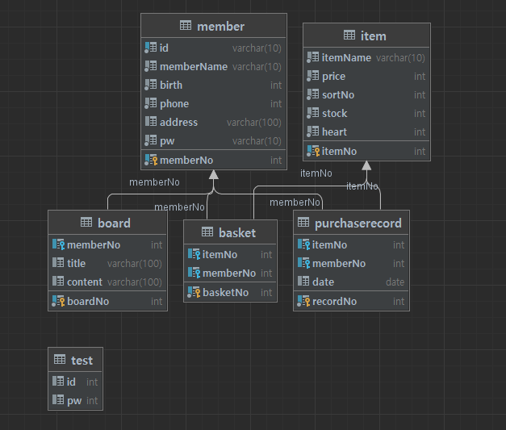

# ShoppingMall 프로젝트
# start "23.11.24" ~ 

## 세번째 프로젝트
#### 개인 프로젝트, 1인
#### 주제 = "쇼핑몰 사이트"
#### 개발 환경 - java & spring Boot / mysql & mybatis / thymeleaf
#### 주요 기능 
제품 리스트 및 상세보기, 찜 / 게시판 리스트 및 작성 / 회원가입 및 정보변경, 로그인, 마이페이지 및 장바구니
### ERD

#### 상세 
### 메인 페이지
슬라이드와 하단 포스터로 현재 상영중인 영화들중 몇가지를
보거나 이동할 수 있다.

### 로그인 페이지
session을 이용했으며 추후에 jwt을 이용한 인증/인가를 공부하여 추가할예정

