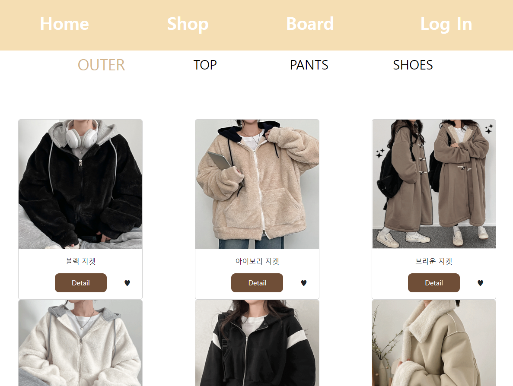
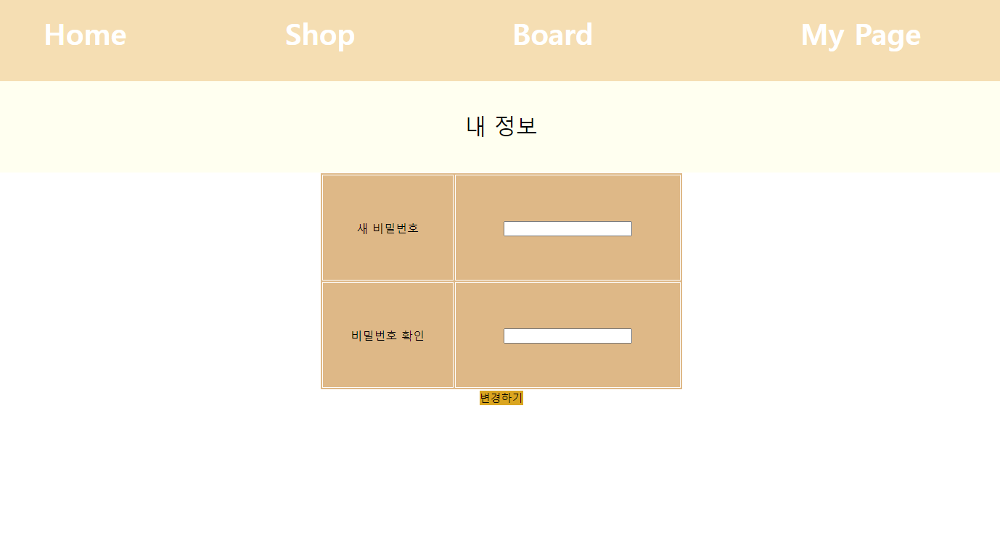

# ShoppingMall 프로젝트
# 기간 "23.11.24" ~ 23.12.22
#### 프로젝트 1차 완성 = ~ 12.05   
  
#### 파일 업로드 기능 추가 = 12.05~ 12.07   
#### 주소 Api 추가 12.08 
#### 소셜 로그인 (kakao) 추가 12.22      

## 세번째 프로젝트   
#### 개인 프로젝트, 1인     
#### 주제 = "쇼핑몰 사이트"     
#### 개발 환경 - java & spring Boot / mysql & mybatis / thymeleaf  
#### 주요 기능    
제품 리스트 및 상세보기, 찜 / 게시판 리스트 및 작성 / 회원가입 및 정보변경, 로그인, 마이페이지 및 장바구니       

    

## 과정 및 후기
- jsp파일을 사용해서 html과 java를 같이 쓰던 때와 다르게 **전부 th: 로 바꿔서 써야 하다보니 jstl과 th의 사용법 차이**가 있었고 이를 익히는 데에 시간이 들었다. 마무리 이후 확실히 **코드 가독성**이 jsp 보다 좋아졌고 **모델 객체들을 사용하는 방식이 더 유연**해졌다.
- **소셜 로그인을 구현**해보면서 **토큰 개념**을 익히는 데에 시간이 걸렸고 덕분에 **로그인 api구현 뿐 아니라 oauth2 의 논리적인 원리와 사용**에 대해 알게 됐다. 다음번 프로젝트에선 새로운 방식의 인가를 적용해 볼 예정이다.
- 카테고리 별 상품 리스트 및 게시판 구현에서의 페이징 처리와 찜, 그리고 로그인 등의 기본적인 **페이지 구현 및 Mybatis 연동**이 굉장히 능숙해졌다. 다음엔 **Mybatis가 아닌 JPA를 공부**하여 프로젝트에 적용해 볼 예정이다.

### ERD
   
 
   
   

#### 상세   
### 메인 페이지

ㄴ슬라이드로 인기 상품이나 이벤트 몇가지를 보거나 이동가능

   

### 상품 페이지

ㄴShop-> 카테고리 4가지로 분류해서 상품들을 보이게하고 상세보기와 찜(장바구니담기)기능을 추가
  

ㄴ상품 상세화면

  

### 게시판 페이지

ㄴ게시판 리스트와 글쓰기

   

### 로그인/마이페이지

ㄴ로그인페이지와 회원가입
  

ㄴ내 정보 페이지와 비밀번호 변경
   

#### 회원가입시 사진파일 추가, 내 정보에서 사진확인 및 다운로드 (23.12.07 추가)
 
ㄴ회원가입시 사진파일 추가 가능   

ㄴ회원가입시 추가한 사진, 그리고 클릭시 해당 사진파일을 다운로드 할 수 있다.   

#### 회원가입시 주소 Api 선택 추가 (23.12.08 추가)

ㄴ회원가입시 주소선택 api 추가
   

#### 소셜 로그인 (kakao) api 추가 (23.12.22)

ㄴ로그인 화면에서 카카오 로그인을 선택할수 있다.   

ㄴ카카오 로그인 화면, 이후 홈화면으로 리다이렉트 된다.
